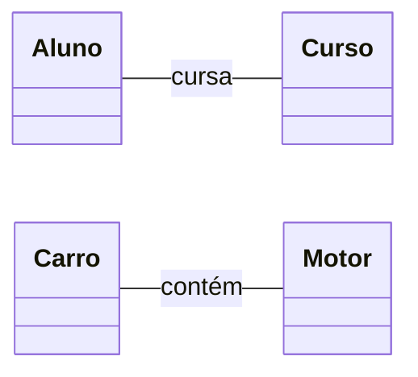
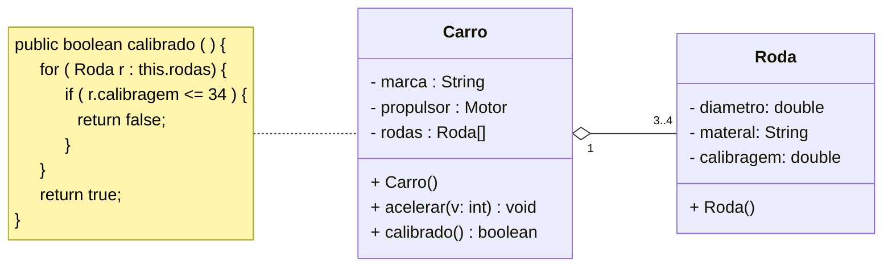
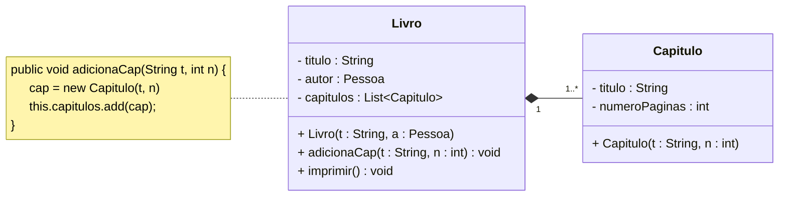
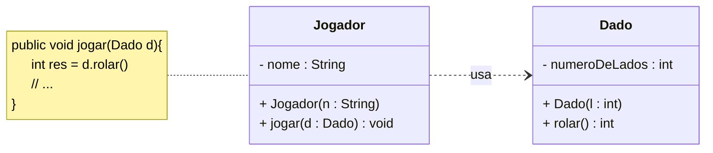
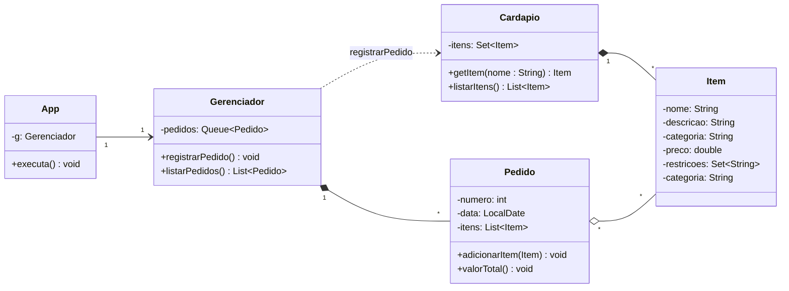

# Aula de Associações - Exemplos

## Elemento classe

## Associação entre classes

### Definição

### Multiplicidade

### Navegabilidade

### Agregação

### Composição

### Dependência

## Exemplo

